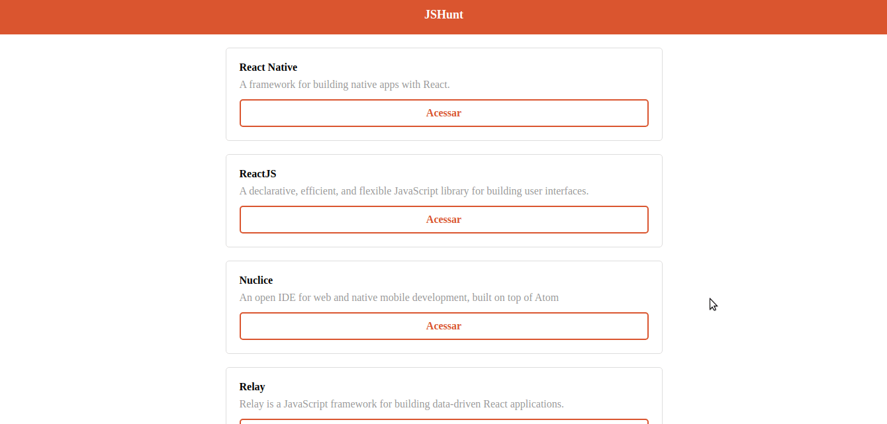

# Starter - React JS
Este é um projeto com a finalidade de entender conceitos do **React JS**, como componentização, estado, ciclo de vida, etc.. O projeto foi realizado junto ao minicurso gratuito (Starter) da RocketSeat.

## Layout
     

## Tecnologias
* React
* Axios

## Linguagens
* JavaScript
* HTML
* CSS

## Executar
**Para executar este projeto na sua máquina, execute os seguintes comandos no seu terminal:**
```
$ git clone https://github.com/dhayananascimento/starter-reactjs.git
$ cd starter-reactjs
$ yarn install
$ yarn start
```
